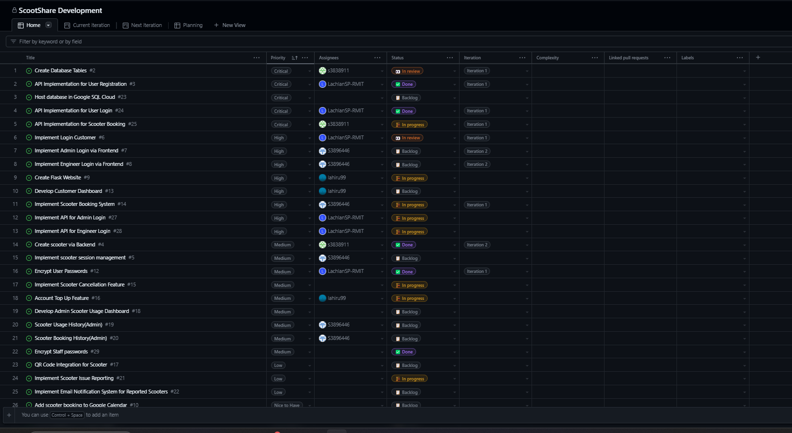
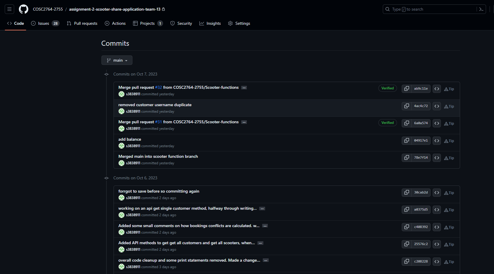
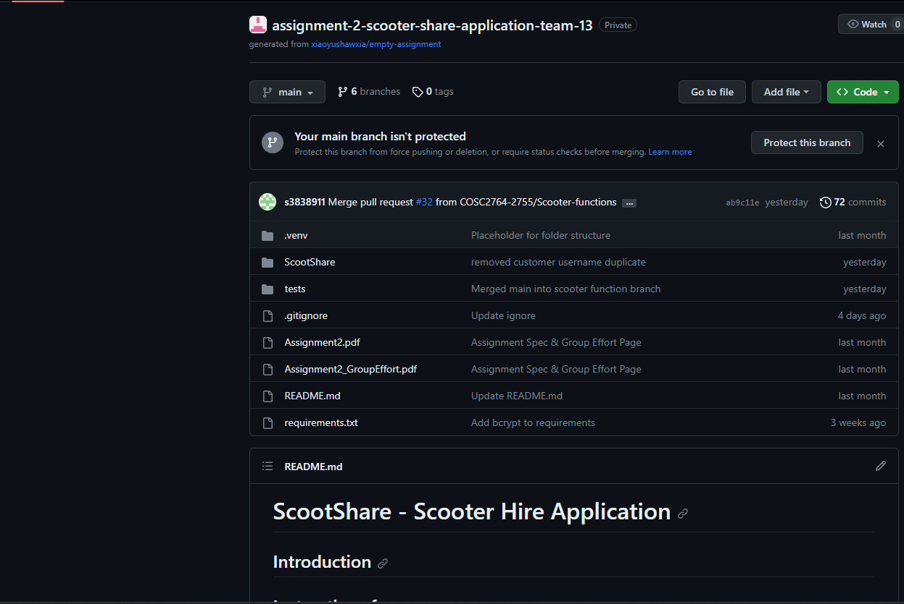

# ScootShare - Scooter Hire Application

## Introduction

Welcome to ScooterShare - a next-generation solution designed to streamline the scooter sharing experience. Our platform provides a comprehensive system for customers, admins, and engineers.

## Instructions for use

### General User

- Register and log in.
- Book and cancel bookings.
- Report scooter issues.
- Top-up account balance.

### Engineer

- Manage scooter and customer data.
- View scooter usage and booking history.
- Handle scooter issues.
- View repair reports and scooter issue reports.

### Administrator

- Repair reported scooters: Update the system once the scooter is fixed and ready to use.
- Report the repair status.

## Credentials

- Admin: Username: `~admin`, Password: `admin`
- Engineer: Username: `_engineer`, Password: `engineer`
- Customer: Username: `test`, Password: `test`

## Project Board

### Trello Board:

## Repository Usage

### GitHub Usage:

🚀 Getting Started

Setup: Ensure you have a Raspberry Pi model 3 or 4.

Python: Make sure Python 3.x is installed.

Repository: Clone this repository to your local machine.

Dependencies: Install the required packages using pip install -r requirements.txt.

Run: Start the application using flask run.
